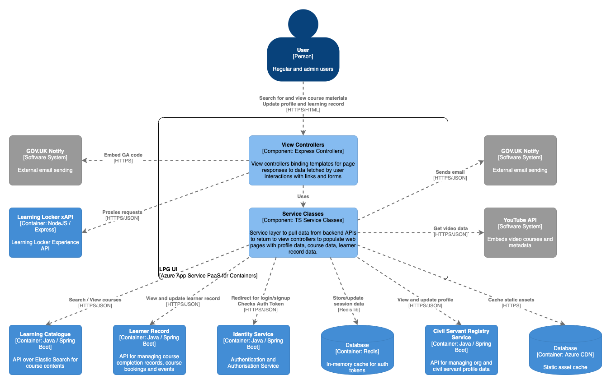

# LPG UI (lpg-services)

 
## Purpose

LPG-UI (previously called lpg-services when the project was a monolithic application) is the NodeJS/Express/GOV.UK Frontend based web application that forms the main website for regular users of the Learning Platform for Government application.

This app hosts the main homepage of the website, redirects users to the management and identity-management areas, acts as a client of backend APIs such as CSRS, Learning Record and Learning Catalogue, and shows the course content uploaded by learning admins.

Course content that records learning experience statements into Learning Locker's XAPI are proxied through the LPG-UI as a 'filter' to remove low-value statements emitted by course content packages which we don't want to store in Learning Locker forever.

## Component overview

See the `diagram/` folder for diagram source in draw.io XML format

## Dependencies

### Build-time

For a complete list of build dependencies check the `package.json` file. The main source dependencies are:
- Azure App Insights 1.5
- typescript 2.9.2
- Express 4.16
- Passport 0.4
- Passport OAuth 1.4
- Axios 0.18
- Redis 2.8
- GOV.UK Frontend 7.2
- Svelte 2.6
- GOV.UK Notify client 4.1

### Test-time

For a complete list of test dependencies check the `package.json` file. The main test dependencies are:  
- mocha 5.2
- sinon 6.1
- sinon-express-mock 2.0
- chai 4.1
- tslint 5.9

### Runtime 

#### Other LPG Services

- `identity-service` for OAuth token validation on all requests
- `learner-record` for loading course completion data
- `learning-catalogue` for searching for courses
- `civil-servant-registry-service` for updating profile information
- `learning-locker-xapi` to receive filtered experience statement and state updates from course packages
- Azure CDN to cache the static web content such as styles, JS, fonts 

#### External integrations

- GOV.UK Notify for sending email notifications to users
- YouTube API for fetching metadata on external embed YouTube video courses
- Google Analytics to fetch and embed analytics code into user facing pages

#### Data Stores

- Redis for user session data

#### Data migrations

- none

## Application Build

The application requires NodeJS 8 and npm installed to build and run. An exhaustive list of build and run commands can be found in `package.json` under `scripts`.

Resolve application dependencies by running `npm install`

Build the application by compiling Typescript and running the SASS preprocessor: `npm run build`

### Styling
* scss is being used for css
* use `npm run watch-sass:ui` to start watching scss files in the ui repo
* `src/[ui/management-ui]/assets/styles/main.scss` is where all styles are being imported
* govuk-frontend-toolkit and -elements are being used and imported in `src/[ui/management-ui]/assets/styles/custom`

We are using the [BEM](http://getbem.com/introduction/) (Block Element Modifier) methodology. To make the scss more readable you can use `@include e('nameofelement'){}` to do `&__(nameofelement){}`. The same with modifiers using `@include m()`.

## Run, test, deploy

Run the project with `npm dev:ui` to watch files for changes or `npm run start:ui` to run normally, or import the project into your IDE of choice such as IntelliJ or VS Code and use the IDE commands to Run Application.

Lint with `npm run lint`, test using `npm run test` for unit tests or choose individual test classes or packages using your IDE.

Webdriver testing: browser type, timeouts, services and browser instances can be configured within [wdio.conf.js](test/webdriver/wdio.conf.js)

The application is packaged as a docker container image - see `Dockerfile` in the root directory for the container definition. `hammer` is the log collector used for aggregating log output. App Insights collection libs are baked in at build time (see reference in dependencies in `package.json`).

The application also inclues a `Jenkinsfile` to define the Jenkins build pipeline stages and linking it to the docker image repository and correct terraform module.

Deployment is controlled via the Terraform scripts in the main PaaS repository, with per-environment configuration values referenced there and secrets injected from keybase.

Azure CDN is used to cache the static assets served by LPG-UI. **After deployment the Azure CDN endpoint for static asset caching needs to be purged** so that the latest version of any changed styles, images, fonts, JS etc can be picked up and recached by the platform. This is completed by using the purge functionality on the static CDN endpoint for each environment (see Terraform config for canonical names).

## Configuration

Significant configuration properties are highlighted here. For the full configuration file see `src/config/` and in particular `src/config/index.ts`

- `cookie` session cookie settings including max validity
- `REDIS` credentials and settings for the Redis session cache
- `CONTENT_URL` path for the uploaded course content CDN
- `CONTENT_CONTAINER` reference for the Azure blob storage account for course content
- `AUTHENTICATION` OAuth client settings and paths for the identity service
- `LEARNER_RECORD` path for the learner-record service
- `COURSE_CATALOGUE` path for the learning-catalogue service
- `REGISTRY_SERVICE_URL` path for the civil-servant-registry-service
- `XAPI` path for the learning locker XAPI
- `GOOGLE_ANALYTICS_ID` GA ID used to associate analytics with domain account
- `GOV_NOTIFY_API_KEY` as named
- `YOUTUBE_API_KEY` key from CSL account on Google Developer Console used to fetch video metadata

## Licenses

LPG UI is licensed by the MIT license, see `LICENSE` in the root folder for details. Dependent applications are licensed as according to their respective readme and license files.

